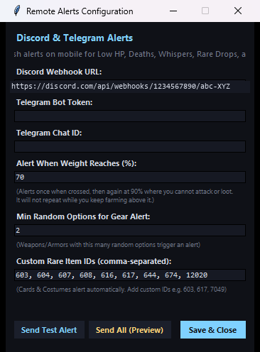

# 🔔 Discord & Telegram Push Alerts Setup Guide

ROZ Overlay has a background notification engine that pushes to your phone through a **Discord webhook**, a **Telegram bot**, or both, when something happens in game that you would want to know about while you are not looking at the screen.

Everything is sent from your own PC to your own webhook or bot. There is no ROZ server in the middle.

---

## ⚡ What triggers an alert

Seven kinds of event. All seven are on by default.

| Alert | Icon | Fires when | What arrives |
| :--- | :---: | :--- | :--- |
| **Low HP** | ⚠️ | HP is at or below **25%** (at most once every 45s) | Character, exact HP/max, percentage, map |
| **Death** | 💀 | HP reaches 0 | Character, map, base level |
| **Base level up** | 🎉 | Base level increases | New level, previous ➔ new, EXP/hour at the time |
| **Job level up** | ✨ | Job level increases | New job level, previous ➔ new |
| **Whisper** | 💬 | A whisper arrives | Sender, which of your characters it was sent to, the message, the time |
| **Rare drop** | 🎴 ⚔️ 👑 🎁 | See the rules below | Item, quantity, why it counted as rare, character, map, and any random options |
| **Overweight** | 🎒 🛑 | Weight crosses your mark, then again at 90% | Character, weight/max, percentage, map |
| **Stream stalled** | 🔌 | No game traffic for 60 seconds | Character and map it was last seen on |

### What counts as a rare drop

A drop has to match one of these, or nothing is sent:

* **🎴 Monster cards** — any card, always.
* **👑 Costumes and shadow gear** — recognised by the slot the item equips to, not by its name, so a costume with an ordinary name still counts.
* **⚔️ Equipment carrying random options** — only when it rolls **2 or more** options (that number is yours to set). The options are listed in the alert by name, up to three of them, with a count of the rest.
* **🎁 Your own watchlist** — a list of item IDs you maintain. Anything on it alerts regardless of the rules above.

### How the weight alerts behave

You choose the first line — 50%, 70%, whatever you want to hear about. The second is fixed at **90%**, which is where the game stops your character attacking or picking anything up, and it is worth interrupting you for even if you already heard the first one.

Between the two lines there is nothing to say. Weight only climbs while you are farming, so "still over the line" would fire on every single pickup from the moment it was crossed. Each line latches once and **only re-arms after the weight actually comes down** (by 3 points, so sitting exactly on the boundary does not re-alert every time one pickup and one potion push you back and forth across it).

Set the mark at 90% or above and you get one line, not two — someone who asked to hear about 95% does not want it twice.

---

## 🎮 Opening the alerts window

1. Launch **`ROZ_Overlay.exe`**.
2. Go to the **Setup** tab.
3. Click **`Alerts`**.

<div align="center">
  
</div>

> [!NOTE]
> The webhook URL shown above is an illustrative placeholder. Everything else
> is the window as it actually looks.

---

## 🟣 1. Discord webhook (about a minute)

A webhook posts rich embed cards into one channel on a server you control.

### Create the webhook
1. Open your Discord server on desktop or mobile.
2. Pick a text channel — a private one, e.g. `#farming-alerts`.
3. **Channel Settings (⚙️)** → **Integrations** → **Webhooks**.
4. **New Webhook**, name it (e.g. `ROZ Overlay`), then **Copy Webhook URL**.

### Paste it into the overlay
1. Paste it into **Discord Webhook URL**:
   ```
   https://discord.com/api/webhooks/1234567890/abc-XYZ...
   ```
   *(An illustrative placeholder — always use your own.)*
2. Click **`Send Test Alert`** and check the channel.
3. Click **`Save & Close`**.

> [!WARNING]
> **A webhook URL is a credential.** Anyone who has it can post into that channel. Do not paste it into a screenshot, a support thread or a Discord message. If it leaks, delete the webhook in Discord and make a new one — that instantly invalidates the old URL.

---

## 🔵 2. Telegram bot (direct push to your phone)

### Create the bot
1. In Telegram, search for `@BotFather`.
2. Send:
   ```
   /newbot
   ```
3. Give it a name and a username (e.g. `MyROZAlertBot`).
4. BotFather replies with an **HTTP API token**:
   ```
   7123456789:AAFlkjw9823lkjsdf-8923jksdf
   ```
   *(An illustrative placeholder — always use your own.)*
5. Open your new bot and press **Start**, so it is allowed to message you.

### Find your chat ID
1. Search for `@userinfobot` or `@GetMyIdBot`.
2. Start the chat — it replies with your numeric **Id** (e.g. `123456789`).

### Paste both into the overlay
1. **Telegram Bot Token** ← your token, **Telegram Chat ID** ← your numeric ID.
2. Click **`Send Test Alert`**.
3. Click **`Save & Close`**.

> [!WARNING]
> **A bot token is a credential too**, and it is worse than the webhook: it controls the whole bot. If it leaks, send `/revoke` to BotFather.

---

## 👀 See every alert before you need one

**`Send All (Preview)`** sends **one of each of the twelve messages** — the connection test, low HP, both level ups, a whisper, a card drop, a gear drop with its options, a costume drop, both weight stages, a death, and a stalled stream — using placeholder names.

These are not mock-ups written to look like the real thing. Each one is produced by feeding fake data to the same functions the live alerts go through, so what lands on your phone is exactly what a real event will send. It also ignores your on/off switches for the duration, so you see the ones you have turned off as well.

It is paced over several seconds on purpose, so the messages arrive in a readable order and do not trip Discord's rate limit.

---

## ⚙️ Settings

In the **Alerts** window:

| Setting | Default | What it does |
| :--- | :--- | :--- |
| **Discord Webhook URL** | empty | Where embed cards are posted |
| **Telegram Bot Token** | empty | Your bot, from BotFather |
| **Telegram Chat ID** | empty | Which chat the bot messages |
| **Alert When Weight Reaches (%)** | `70` | Your first weight line; 90% is always the second |
| **Min Random Options for Gear Alert** | `2` | How many options a piece of gear must roll to be worth telling you about |
| **Custom Rare Item IDs** | 9 IDs | Comma-separated watchlist, e.g. `603, 604, 607, 608, 616, 617, 644, 674, 12020` |

Two settings have no control in the window yet and are read from `state.json` in `%LOCALAPPDATA%\ROZOverlay\`:

* **`hp_threshold`** — the low-HP line, `0.25` by default (25%).
* **`enabled_events`** — the per-event on/off switches: `low_hp`, `death`, `disconnect`, `level_up`, `whisper`, `rare_drop`, `weight`. All `true` by default.

---

## 🔒 Where your credentials are kept

The webhook URL, the bot token and the chat ID are saved in `state.json` in your user profile. **Since v1.7.0 they are encrypted with Windows DPAPI**, tied to your Windows account: if that file is copied to another PC, or picked up out of a backup, the credentials in it are unreadable. They were stored in plain text before that.

Nothing is sent anywhere unless you configure an endpoint. Alerts are the only feature that transmits off your PC apart from phone access to the dashboard.

---

## 🧯 If nothing arrives

* **Press `Send Test Alert` first.** It reports success or failure in the window itself, which separates "the overlay is not sending" from "the event never fired".
* **Discord: check the channel the webhook belongs to**, not the server — a webhook only ever posts to the one channel it was created in.
* **Telegram: did you press Start on your own bot?** A bot cannot message you until you do, and this is the usual cause.
* **A drop that did not alert** is usually the options rule: gear needs 2 or more random options by default. Cards and costumes always alert.
* **Weight only alerted once** — that is deliberate. It re-arms after the weight comes back down.
* **Multi-client**: every alert names the character and map that triggered it, so two clients running at once stay distinguishable.
