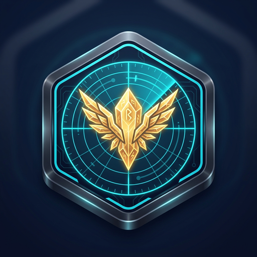
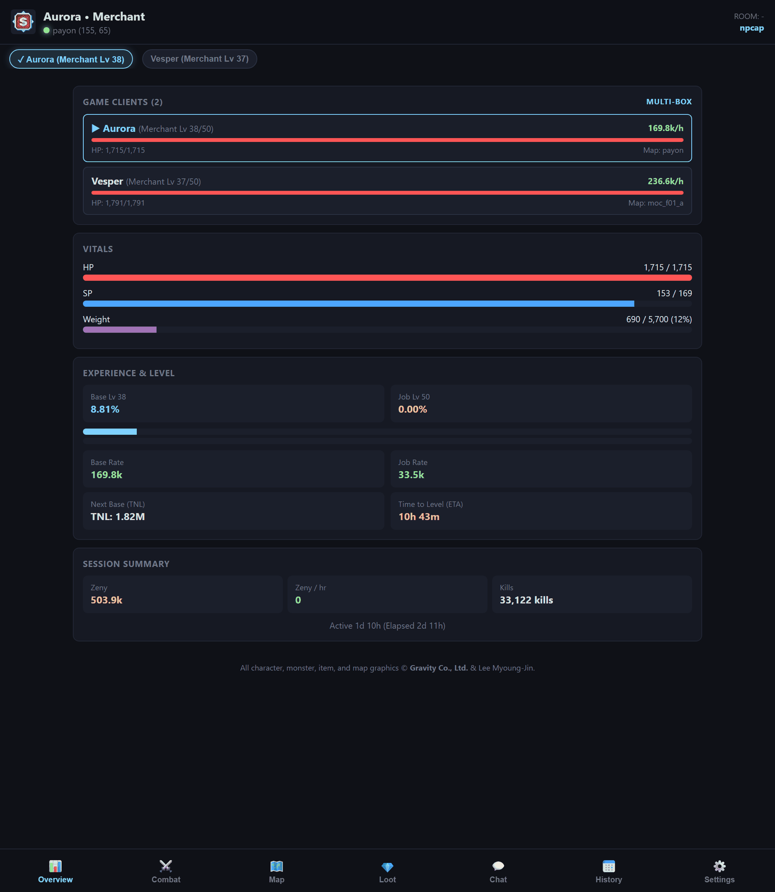
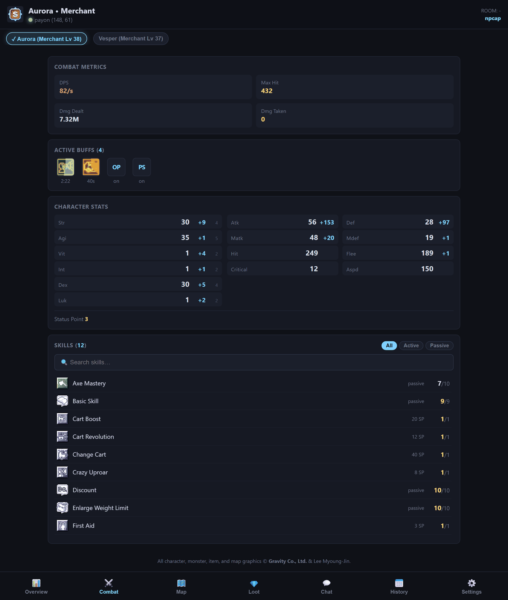
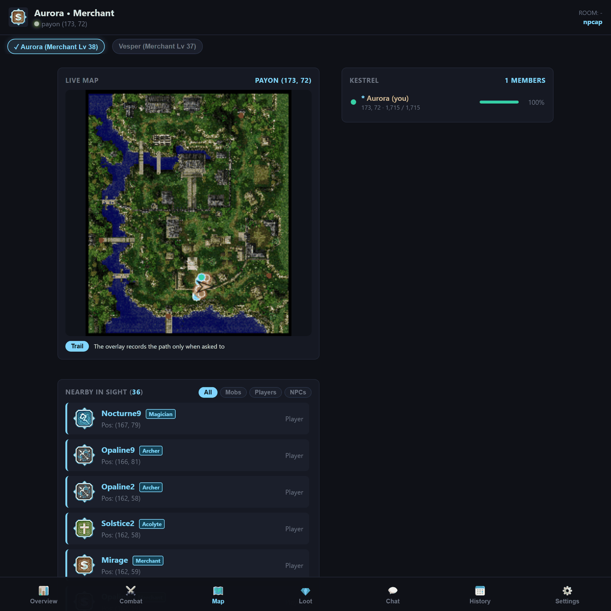
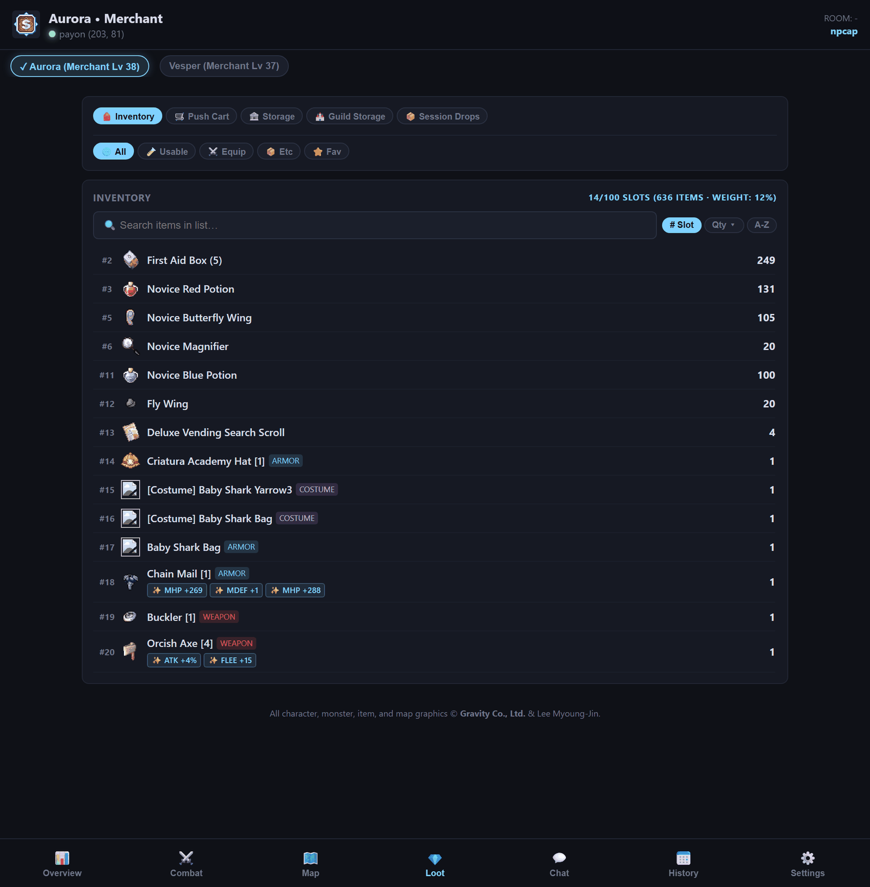
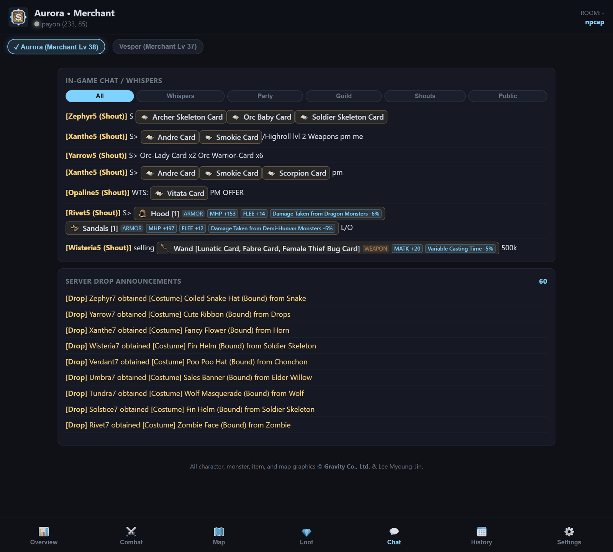
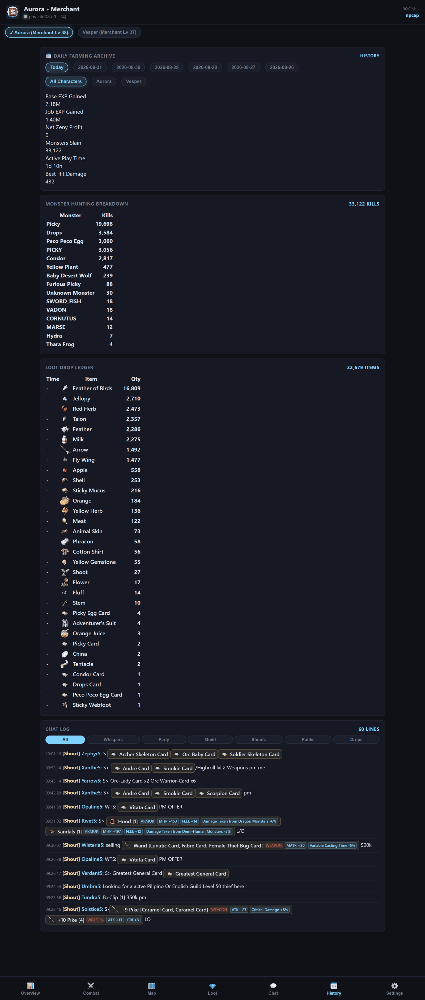
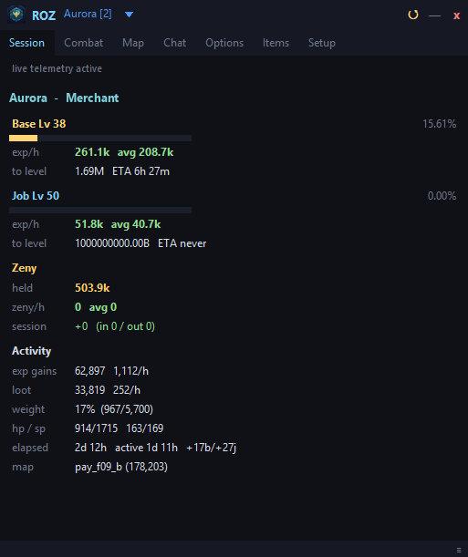

<div align="center">
  
  <h1>📱 ROZ Monitor — Live Remote Companion & Web Dashboard</h1>
  <p><b>Real-time mobile telemetry & radar companion for Ragnarok Zero & Renewal</b></p>
  <p>
    <a href="https://samuel23.github.io/roz_monitor/"></a>
    <a href="https://github.com/Samuel23/roz_monitor/releases"></a>
    
  </p>
</div>

---

## 📸 Screenshots & Visual Preview

> [!NOTE]
> Every character name in these screenshots — mine and everyone else's — has been
> replaced with a pseudonym. The item names, monster names, numbers and chat are
> exactly as they were captured from a live session.

<div align="center">
  <table>
    <tr>
      <td align="center" width="50%" valign="top">
        <b>📊 Overview — multi-box, vitals, EXP/hr</b><br>
        
      </td>
      <td align="center" width="50%" valign="top">
        <b>⚔️ Combat — buffs, stat sheet, skills</b><br>
        
      </td>
    </tr>
    <tr>
      <td align="center" valign="top">
        <b>🗺️ Map — live position, party, who is nearby</b><br>
        
      </td>
      <td align="center" valign="top">
        <b>💎 Loot — gear with its random options</b><br>
        
      </td>
    </tr>
    <tr>
      <td align="center" valign="top">
        <b>💬 Chat — shouts with the gear spelled out</b><br>
        
      </td>
      <td align="center" valign="top">
        <b>📅 History — the day, kept</b><br>
        
      </td>
    </tr>
    <tr>
      <td align="center" colspan="2" valign="top">
        <b>🖥️ Desktop overlay — the companion window on your PC</b><br>
        
      </td>
    </tr>
  </table>
</div>

---

## ⚡ Features

* **🗺️ High-DPI Vector Radar**:
  * Renders official map geometry with real-time player position and path trail.
  * Plots nearby monsters with live HP bars and MVP / Boss danger indicators.
  * Displays players, NPCs, and warp portals in real-time.
* **📊 Experience & Combat Telemetry**:
  * Real-time Base & Job EXP/hr rates, % progress bars, and Time-to-Level (ETA).
  * Live combat DPS meter, damage dealt vs. taken, and max hit record.
  * Active buffs ledger with remaining countdown timers.
* **💎 Loot & Container Management**:
  * Session loot drop counters and acquisition rates (items/hr).
  * Category switcher for **Backpack Inventory**, **Merchant Push Cart**, and **Kafra Storage** with instant name filtering.
* **🚨 Mobile Audio Alarms & Haptics**:
  * Distinct sound chimes for Low HP warnings, Level Up fanfares, and incoming whispers.
  * Device vibration and screen wake-lock (prevents phone from sleeping while farming).
* **🔔 Discord & Telegram Push Alerts**:
  * Direct webhook & bot push notifications to your phone for Low HP (<25%), Deaths, Whispers, and Rare Drops. 👉 **[View Setup Guide](DISCORD_TELEGRAM_ALERTS.md)**
* **🎮 Multi-Client Support**:
  * Seamlessly switch between multiple active game clients with the multi-box fleet bar.
* **🧩 Reads Your Own Game Client**:
  * Item names, slot counts, random-option wording, skill and status-effect text are read from the client installed on your PC — including its icons and map images.
  * A patch that adds items is picked up on the next start, so new gear is named instead of showing up as `item#480824`. 👉 **[How this works](#-how-it-stays-correct-after-a-game-patch)**

---

## 🧩 How it stays correct after a game patch

Almost everything the game shows you is **client-side**. When you loot something, the server sends an id and nothing else — `480824` — and your client looks the wording up in its own tables. So a companion tool needs those tables, and a tool that only ships a copy of them starts drifting the day the game is patched.

That drift is not slow. Between two patches a week apart, this server added **46 items and renamed one** — and the rename (`Costume Paw Backpack` → `[Costume] Meow Jelly Backpack`) is the kind that makes a drop alert look *wrong* rather than merely incomplete.

The current answer is already on your disk, because the client that was just patched is installed there. So the overlay reads it.

### What it reads

It finds your installation on its own — from the processes it is already capturing, or from where it found the client last time, which is what lets it work while the game is closed. A default install sits at something like `C:\Gravity\RagnarokZero`. If it guesses wrong, **Setup → Game Data** lets you point at the folder yourself.

Out of the client's own data files come eight tables:

| Table | Typical entries | What it fixes |
|---|---:|---|
| Item names | 3,905 | Loot, inventory and chat links read the way your tooltip does |
| Slot counts | 388 | `Hood [1]` rather than `Hood` |
| Random options | 252 | `Variable Casting Time -10%` rather than `Opt #170: +10` |
| Skill names | 1,053 | The skill list, with icons |
| Status effects | 965 | Buff names and their tooltips |
| Monster names | 1,400 | Kill counts and drop alerts |
| Job names | 2,691 | Class labels on nearby players |
| Interface text | 13,980 | The client's own wording for shared strings |

Plus the pictures: **415 status icons**, **901 skill icons** and the map images behind the live radar, extracted to your profile the first time they are needed. None of them are redistributed — they come off your own installation.

### It re-reads only when the game changes

Reading the client on every start would be wasted work. Instead the overlay keeps a fingerprint of the files a patch would have to touch, and compares it: same fingerprint, use the cache; changed, read again. A patcher cannot avoid changing them, so **a patch is what triggers the work, and nothing else does**.

### Which source wins

The client's tables are merged **over** the ones that ship with the release, never in place of them — and which one wins is decided per table, by looking at what the merge actually produced:

* **The client wins for items, options, skills and status effects.** Its string *is* the text you are reading on your own screen.
* **The client may only add for monsters and jobs.** All it has for those is the sprite table, and a sprite table is not a display-name table: it calls Swordsman "Swordman", Priest "Prieset", Wizard "Wizerd", and turns Super Novice into Korean. It would have overwritten 193 curated names with worse ones. What it does contribute is the ids nobody has named yet — **865 of them** — which is real, and is all it is allowed to do there.

Reading your client is also the only source that is right by construction: a server can patch in items no public database has ever heard of, and this still names them.

### If it cannot

Every failure means *carry on with the tables that shipped* — a game that is not installed on this PC, a client caught mid-patch with a half-written file, an unreadable cache. The overlay never breaks because it could not read the client; it just stops improving on what it already knew.

---

## 🛡️ Security & Integrity Verification

Official release binary integrity and SHA-256 verification:

| File | Size | SHA-256 Checksum |
|:---|:---|:---|
| **`ROZ_Overlay.exe`** | 12.9 MB | `76db7db3dea5eda2f23fcd821f998630e8ce18938ef55347e5a1b6ac2eaa2d05` |
| **`ro_data.bin`** | 15.6 MB | `49a75aa5b41d5c9537b4b84babd29dd7ff487674e2ddb8c7c5f5628f2cebe64b` |

### ⚠️ Windows will say "unknown publisher" — here is why, and what to do

The build is signed, but with a **self-signed certificate**: it proves the file
has not been altered since it was built, but nothing vouches for *who* built it,
so SmartScreen shows the unknown-publisher warning. A commercial certificate
costs a few hundred dollars a year and still has to accumulate reputation before
the warning goes away.

The checksum is what actually verifies your download. `verify_download.ps1` is
included in the release zip — run it in the folder you downloaded into:

```powershell
powershell -ExecutionPolicy Bypass -File verify_download.ps1
```

Compare what it prints against the table above. **If either hash differs, delete
the files and download again — do not run them.** A build being flagged by an
antivirus is possible for this kind of tool — it is a packed Python executable
that opens a packet-capture device, a combination some heuristics dislike —
though Windows Defender passes the current build cleanly. The checksum is how
you tell a false positive from a real one.

### 🔄 Updates are signed

The overlay checks for updates itself and applies them in place. The update
manifest carries an **Ed25519 signature**, which the app verifies before it reads
anything out of it — so an update can only come from whoever holds the release
key, not merely from someone who can put a file on the download host. Each
downloaded file is then checked against its SHA-256 before it is installed, and
if an install cannot be completed the previous version is put back rather than
left half-replaced.

### 🔑 Administrator

The overlay does **not** ask for Administrator when it starts. It tries to read
the connection first, and only if every method is refused does it tell you so and
offer a **Restart as Administrator** button in the Setup tab. On a PC with Npcap
installed without its "restrict to Administrators" option, it never needs to ask
at all. Declining is survivable either way — saved history, the dashboard and
replaying a capture all still work; only live tracking stops.

### 🔒 Zero-Injection Architecture
* ❌ **No DLL Injection**
* ❌ **No Memory Reading / Writing**
* ❌ **No Client File Modification** — the game’s data files are opened read-only, to read the names it already shows you, and nothing is written back
* ❌ **Nothing is ever sent to the game server** — the capture socket is receive-only
* ✅ **100% Passive Telemetry**
* 🔐 **PIN-protected dashboard** — served to `127.0.0.1` unless you switch phone access on, and the PIN is never put in a URL or in the pairing announcement

> [!NOTE]
> When phone access is on, the connection runs over HTTPS through a public
> tunnel provider so your phone can reach your PC. That provider relays the
> traffic and can see it, exactly as with any hosted page — so it is protected
> by your PIN, not by end-to-end encryption. Leave phone access off if that
> matters to you; everything on the PC works without it.

---

## 🚀 Quick Start & Pairing

1. **Launch Desktop Companion**:
   Download and run **`ROZ_Overlay.exe`** on your PC from [GitHub Releases](https://github.com/Samuel23/roz_monitor/releases).
2. **Scan QR Code**:
   Go to the **Setup** tab on the overlay and scan the pairing QR code with your mobile phone camera.
3. **Install as Mobile App (PWA)**:
   In your mobile browser (Safari on iOS or Chrome on Android), tap **Share** / **Options** $\rightarrow$ **"Add to Home Screen"** to install it as a standalone full-screen app.

---

## 💻 Desktop Companion Releases

| Component | Description | Size |
|---|---|---|
| **`ROZ_Overlay.exe`** | Fast native Windows companion launcher (No Wireshark or Npcap required) | ~12 MB |
| **`ro_data.bin`** | Game schemas, item/mob database, and 400+ minimap PNG textures | ~15 MB |
| **`ROZ_Overlay_vX.X.X.zip`** | Complete release distribution package containing both files | ~27 MB |

👉 **[Download Latest Release](https://github.com/Samuel23/roz_monitor/releases)**

---

## 🛠️ Frequently Asked Questions & Troubleshooting

### 📡 1. Packet Synchronization Lifecycle & Missing Details
> **"Why does my inventory, cart, or character name occasionally show empty after launching the companion?"**

Because ROZ Companion operates **100% passively** without injecting code or reading your game's memory, it captures data that is broadcasted via standard network protocols during normal gameplay:

* **🎒 Backpack Inventory & Equipped Gear**:  
  Transmitted by the server **only once upon entering a world map** after character selection.
* **🛒 Merchant Push Cart**:  
  Transmitted when opening your pushcart in-game (`Alt+W`).
* **🏦 Storage**:  
  Transmitted when opening Storage via NPC.
* **🗺️ Character Name, Map, and Area Entities**:  
  Broadcasted whenever you enter a new map, change zones, or use a **Fly Wing / Teleport** (even within the same map).

> [!TIP]
> **Recommended Best Practice for a 100% Full Sync:**  
> If you start `ROZ_Overlay.exe` while already standing in the game world, simply press `Esc` $\rightarrow$ **Character Select** and re-enter your character. This prompts the server to re-broadcast your full inventory, equipment options, and character profile.

---

### 💾 2. Local Storage & Data Privacy Transparency
> **"Where is my data saved, and what exactly is being recorded?"**

All companion telemetry is saved strictly on your local PC in your user profile:
```
%LOCALAPPDATA%\ROZOverlay\
```

#### What files are stored locally?
* `state.json`: Window position, UI preferences, and character profiles. It also holds your dashboard PIN, the pairing sync key, and any Discord webhook or Telegram token you set up — **those four are encrypted with Windows DPAPI**, so they are tied to your Windows account and are unreadable if the file is copied to another PC or picked up out of a backup.
* `status.json` / `inventory.json` / `chat.json`: Temporary local telemetry snapshots used to power the desktop overlay and web dashboard.
* `history/YYYY-MM-DD/<Character>/summary.json`: Daily farming summaries for reviewing personal EXP/hr rates, total zeny earnings, and monster drops.
* `history/YYYY-MM-DD/<Character>/chat.jsonl` and `shouts.jsonl`: **The day's chat log, kept for 30 days.** See the note below.

#### Sample of recorded data (`history/.../summary.json`):
```json
{
  "date": "2026-08-25",
  "character": "Solaris",
  "job": "Knight",
  "base_exp_gained": 145200,
  "job_exp_gained": 98400,
  "zeny_net": 125000,
  "kills_total": 86,
  "kills_breakdown": {
    "Mandragora": 48,
    "Poring": 38
  },
  "loot": {
    "Stem": 48,
    "Jellopy": 38
  }
}
```

> [!NOTE]
> **No Sensitive Data Stored:** Passwords, account credentials, master logins, and private authentication tokens are never parsed or written to disk.

> [!IMPORTANT]
> **About chat.** The game server sends your client every public message, shout and whisper you can see — that is simply how the game works — so this tool reads them too, and saves the day's chat on your PC so the log survives a restart. It is deleted automatically after 30 days, and **Settings → Clear Saved Chat** removes all of it now. Nothing chat-related leaves your PC unless you turn on phone access or alerts (below).

---

### 🔐 3. Privacy & Account Credentials Guarantee
> **"How can I be 100% sure my login details, passwords, or PIN codes are never captured?"**

* **Architecture Guarantee**: The companion tool completely ignores login and character authentication servers. It passively listens only to active in-game world events once you are playing inside the game.
* **Zero-Risk Verification Method**: If you want absolute peace of mind, **launch `ROZ_Overlay.exe` only AFTER you have already logged in and entered the game world.**
* **Local by default**: All calculations (EXP/h, loot counts, radar tracking) are computed on your own PC, and the dashboard is served to `127.0.0.1` only. Two optional features — and only these two — send anything outward, both off until you switch them on:
  * **Phone access.** Turning it on opens a public HTTPS tunnel so your phone can reach the dashboard from anywhere. The tunnel provider relays the traffic, so treat it as you would any hosted page: it is protected by your PIN, and the PIN is never put in the URL or in the pairing announcement.
  * **Discord / Telegram alerts.** If you add a webhook or bot token, the text of each alert is sent to that service — **including the text of a whisper**, if you enable whisper alerts.

---

### 👥 4. Multi-Client / Multi-Boxing Focus
> **"I am playing on multiple accounts. How do I switch which character the overlay is tracking?"**

* **Instant Switching**: Look at the fleet selector bar at the top of the overlay window or mobile web portal. Click any character name to immediately switch live telemetry, inventory, and stats to that client window.

---

### 📡 5. Telemetry Status Shows "Searching / Connecting"
> **"The overlay is open, but telemetry events are not incrementing."**

* **Quick Fix**: Walk a few steps in-game or cast any skill. The capture engine passively detects the active socket as soon as the game client exchanges traffic with the server.

---

### 📱 6. Mobile Web Portal Pairing
> **"How do I connect my mobile phone or tablet to the live monitor?"**

* **1-Scan Pairing**: Open the **Setup** tab on your desktop overlay and scan the pairing QR code with your phone's camera.
* **Manual Room Code & PIN**: Alternatively, open [https://samuel23.github.io/roz_monitor/](https://samuel23.github.io/roz_monitor/) on any device, enter the **Room Code** and **4-digit PIN** displayed on your desktop Setup tab, and tap **Connect**.
* **Reconnecting**: If you close your browser or change tabs, simply re-enter your Room Code and PIN to immediately resume your live session.

---

## ☕ Support development

ROZ Overlay is free and stays free. Nothing is behind a paywall, no feature is
held back, and updates do not depend on anyone paying — that is not going to
change. If it has been useful to you and you feel like putting something in the
tip jar, it is genuinely appreciated:

<div align="center">
  <a href="https://ko-fi.com/elijahawesam">
    
  </a>
</div>

It goes toward development — the time to build new features, fix what breaks, and
keep up with the game client as it is patched. If it ever adds up to more than
that, the next thing on the list is a [code-signing
certificate](#-windows-will-say-unknown-publisher--here-is-why-and-what-to-do),
which would retire the "unknown publisher" warning on new downloads.

No obligations in either direction. A tip buys no priority and no promises, and
not tipping costs you nothing — you get the same build either way.

---

## ⚖️ Legal & Copyright Notice

ROZ Monitor and ROZ Overlay are independent open-source companion tools.  
All character graphics, monster sprites, item icons, map textures, and registered trademarks are the intellectual property of **Gravity Co., Ltd.** & Lee Myoung-Jin.
