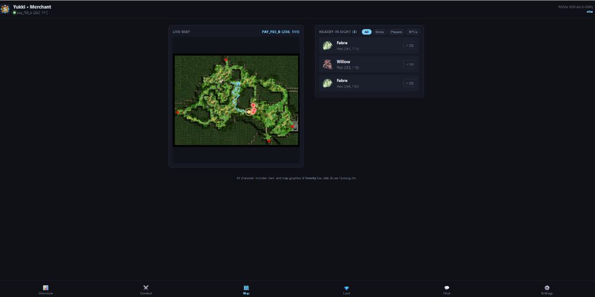
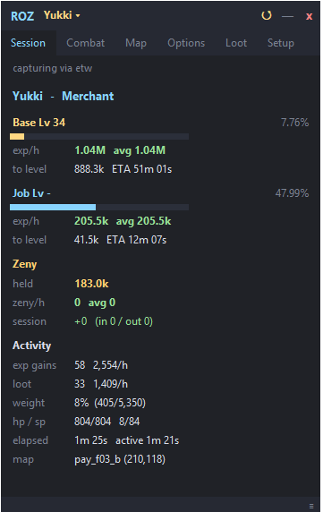

  
  <h1>📱 ROZ Monitor — Live Remote Companion & Web Dashboard</h1>
  
<b>Real-time mobile telemetry & radar companion for Ragnarok Zero & Renewal</b>

  

    
    
    
  

---

## 📸 Screenshots & Visual Preview

  <table>
    <tr>
      <td align="center" width="62%" valign="top">
        <b>Live Web Radar Dashboard</b> 
        
      </td>
      <td align="center" width="38%" valign="top">
        <b>Desktop Overlay Companion</b> 
        
      </td>
    </tr>
  </table>

---

## ⚡ Features

* **🗺️ High-DPI Vector Radar**:
  * Renders official map geometry with real-time player position and path trail.
  * Plots nearby monsters with live HP bars and MVP / Boss danger indicators.
  * Displays players, NPCs, and warp portals in real-time.
* **📊 Experience & Combat Telemetry**:
  * Real-time Base & Job EXP/hr rates, % progress bars, and Time-to-Level (ETA).
  * Live combat DPS meter, damage dealt vs. taken, and max hit record.
  * Active buffs ledger with remaining countdown timers.
* **💎 Loot & Container Management**:
  * Session loot drop counters and acquisition rates (items/hr).
  * Category switcher for **Backpack Inventory**, **Merchant Push Cart**, and **Kafra Storage** with instant name filtering.
* **🚨 Mobile Audio Alarms & Haptics**:
  * Distinct sound chimes for Low HP warnings, Level Up fanfares, and incoming whispers.
  * Device vibration and screen wake-lock (prevents phone from sleeping while farming).
* **🎮 Multi-Client Support**:
  * Seamlessly switch between multiple active game clients with the multi-box fleet bar.

---

## 🛡️ Security, Antivirus & Integrity Verification

All release binaries are scanned against 70+ antivirus engines on VirusTotal:

| File | Size | SHA-256 Checksum | VirusTotal Report |
|:---|:---|:---|:---:|
| **`ROZ_Overlay.exe`** | 12.2 MB | `6d9993a5e1463981bf8b40e49cad27d4f43f717b08c7599f196b1349f0fee541` | [🔍 View VirusTotal Scan](https://www.virustotal.com/gui/file/6d9993a5e1463981bf8b40e49cad27d4f43f717b08c7599f196b1349f0fee541) |
| **`ro_data.bin`** | 15.1 MB | `cbeb00b805968435071aff36847b6640d4f941a61f36ce640ab35beda04e4e2d` | [🔍 View VirusTotal Scan](https://www.virustotal.com/gui/file/cbeb00b805968435071aff36847b6640d4f941a61f36ce640ab35beda04e4e2d) |

### 🔒 Zero-Injection Architecture
* ❌ **No DLL Injection**
* ❌ **No Memory Reading / Writing**
* ❌ **No Client File Modification**
* ✅ **100% In-Memory Passive Telemetry**
* 🔐 **End-to-End WebSocket Encryption** via Room Code & PIN

---

## 🚀 Quick Start & Pairing

1. **Launch Desktop Companion**:
   Download and run **`ROZ_Overlay.exe`** on your PC from [GitHub Releases](https://github.com/Samuel23/roz_monitor/releases).
2. **Scan QR Code**:
   Go to the **Setup** tab on the overlay and scan the pairing QR code with your mobile phone camera.
3. **Install as Mobile App (PWA)**:
   In your mobile browser (Safari on iOS or Chrome on Android), tap **Share** / **Options** $\rightarrow$ **"Add to Home Screen"** to install it as a standalone full-screen app.

---

## 💻 Desktop Companion Releases

| Component | Description | Size |
|---|---|---|
| **`ROZ_Overlay.exe`** | Fast native Windows companion launcher (No Wireshark or Npcap required) | ~12 MB |
| **`ro_data.bin`** | Encrypted game schemas, item/mob database, and 400+ minimap PNG textures | ~15 MB |
| **`ROZ_Overlay_vX.X.X.zip`** | Complete release distribution package containing both files | ~27 MB |

👉 **[Download Latest Release](https://github.com/Samuel23/roz_monitor/releases)**

---

## ⚖️ Legal & Copyright Notice

ROZ Monitor and ROZ Overlay are independent open-source companion tools.  
All character graphics, monster sprites, item icons, map textures, and registered trademarks are the intellectual property of **Gravity Co., Ltd.** & Lee Myoung-Jin.
